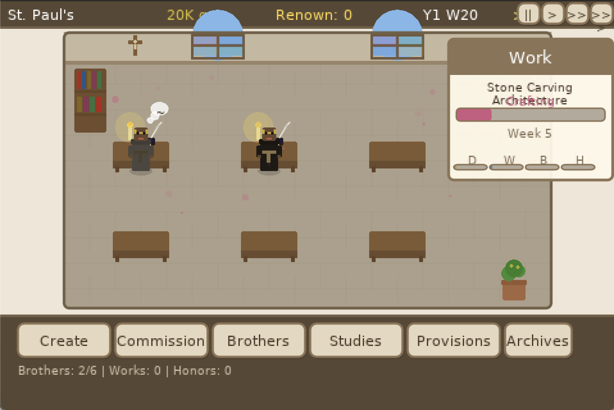

# Ora et Labora

A monastery management simulator built with [LOVE2D](https://love2d.org/). Guide your monks through creating illuminated manuscripts, brewing ale, composing sacred music, and building your abbey's renown — all with procedurally generated graphics and audio.

<!--  -->

## Why

There aren't many management sims set in a medieval monastery. Run a scriptorium, manage monks with distinct vocations, court patrons from local parishes to the papal court, and hope for divine inspiration along the way.

## Install

```bash
# macOS
brew install love

# Ubuntu/Debian
sudo apt-get install love

# Windows — download from https://love2d.org/
```

## Run

```bash
love .
```

## How to Play

- **Create** works by choosing a work type (Manuscript, Sacred Music, Ale & Mead...), a subject (Saints' Lives, Gospel, Psalms...), and a patron (Local Parish, Bishop's See, Royal Court...)
- **Recruit** monks with different vocations — Scribes, Illuminators, Scholars, Cantors, Brewmasters
- **Form** your brothers through training to improve their Faith, Wisdom, Beauty, and Harmony stats
- **Commission** work from patrons for quick gold
- **Study** to unlock new work types and subjects
- **Acquire provisions** — better ink, vellum, sacred relics — to boost your current work

Works go through five phases: **Planning → Crafting → Devotions → Scribing → Reviewing**. After completion, four evaluators (Bishop's Council, Abbey Chronicle, Scholar's Circle, Pilgrim's Report) score the work, and it enters distribution to earn gold and renown.

### Controls

| Key | Action |
|-----|--------|
| `Space` | Pause / unpause |
| `1` `2` `3` | Set game speed |
| `S` | Save |
| `Esc` | Close dialog |

## Tech

- **Zero external assets** — all graphics are drawn with rectangles, circles, and lines; all audio is synthesized at runtime
- **Virtual resolution** 480×320, scaled to window
- Pure Lua, single-threaded, ~5300 lines across 11 modules

## License

[MIT](LICENSE)
